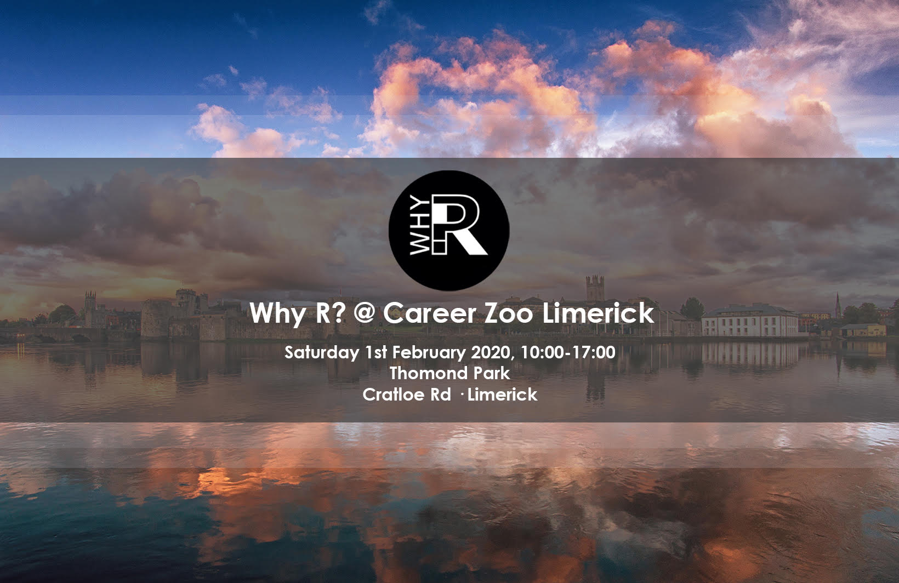
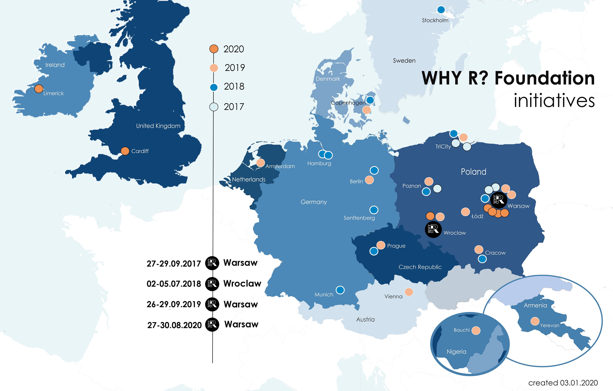
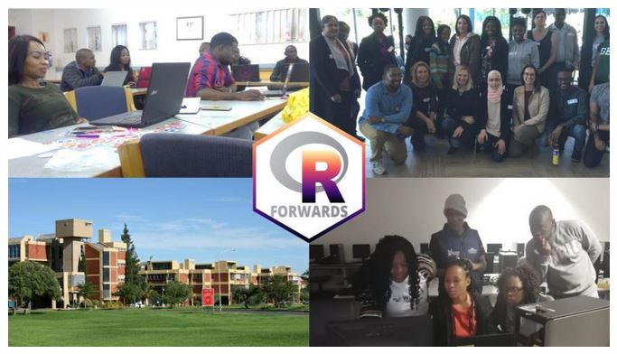
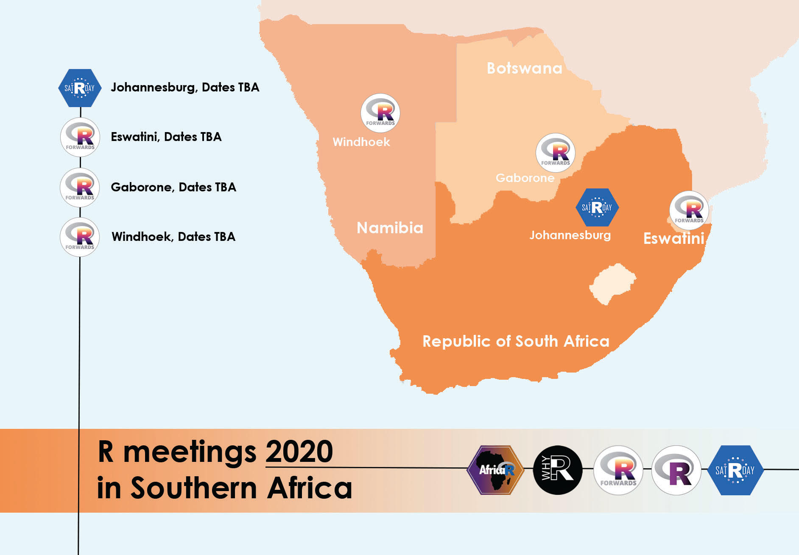

```{r setup, include=FALSE}
knitr::opts_chunk$set(echo = TRUE)

```

Why R? Limerick 2020
===============================

Column {data-width=700}
--------------------


<div class="container">
<center>
<div>

</div>
</center>
</div>

Column {data-width=800}
---------------

#### Why-R? Limerick 

* Date: Saturday 1st February 2020
* Location: Thomond Park Stadium, Cratloe Road, Limerick.
* Times: 10.00am to 16:30pm approx
* Career Zoo Limerick's [Website](https://www.careerzoo.ie/limerick/)
* Why R? Limerick's [Website](https://www.careerzoo.ie/limerick/why-r-mini-conference.html)

<h5> Tickets </h5>
* Admission is free, but attendees must have registered for Career Zoo.


Tickets
===============================

<h5> Tickets</h5>

* Tickets can be ontained from [Career Zoo's Eventbrite Page](https://www.eventbrite.ie/e/career-zoo-presents-tech-on-the-wild-atlantic-way-2020-tickets-77292514993#tickets)
* Tickets are free, but you must register for the event in advance.
* You should register for both Career Zoo and Why R?
* Please note that there are a limited number of tickets for the WhyR? event.

Schedule
===============================

Column
-------------------------------

### Schedule

<h3> Schedule </h3>


<br>


| Time | Talk |
|----------:|:----------------------------------------------------|
| 10:00-10:30 | <b>Morning Session 1 (Munster Suite)</b> <br> What makes a good (fantasy) football manager? <br> Presented by [Joey O'Brien](https://twitter.com/obrienj_) |
| 10:30-11:00 | <b>Morning Session 2 (Munster Suite)</b> <br> Using R-Shiny to Teach Quantitative Research Methods <br> Presented by [Dr. Brendan Halpin (UL Sociology)](https://twitter.com/BrendanTHalpin) |
| | (*Break*) |
|11:20-11:50| <b>CAREER ZOO COMMUNITY KEYNOTE @ Main stage</b> <br> [Dr. Norah Patten](https://twitter.com/SpaceNorah) <br> Astronaut candidate with Project PoSSUM (Polar Suborbital Science in the Upper Mesosphere)  <br> (*N.B. This is not an R-specific talk*) |
| | (*Pause*) |
| 12:00-12:30 | <b>Morning Session 3 (Munster Suite)</b> <br> ETL with R: a quantitative finance application <br> Davide Magno |
| 12:30-13:00 | <b>Morning Session 4 (Munster Suite)</b> <br> R  - a Disruptive Force in Official Statistics <br> Sorcha O'Callaghan <br>                Central Statistics Office, Cork [www.cso.ie](www.cso.ie) |
| | (*Pause*) |
|13:10-13:40| <b>CAREER ZOO COMMUNITY KEYNOTE @ Main stage</b> <br>     Helping beekeepers to reduce honeybee losses & increase hive productivity with IOT technology.<br> Dr Fiona Edwards Murphy, CEO and Co-founder of [ApisProtect](https://www.apisprotect.com/home) <br> (*N.B. This is not an R-specific talk*) |
| | (*Break*) |
|14.10 - 14:40 |  <b>Afternoon Session 1 (Munster Suite)</b> <br>   Knime with R <br>         Presented by [Paolo Tamagnini](https://twitter.com/paolotamag) |
|14.40 - 15:10 |  <b>Afternoon Session 2 (Munster Suite)</b> <br>   Data Optimisation Networks <br>         Gaurav Pahuja <br>         (Finalist in the Student Data Scientist of the Year category of the  [DatSci Awards 2019](https://www.datsciawards.com/finalists-2019/#/))|
| | (*Pause*) |
|15:20-15:50| <b>CAREER ZOO COMMUNITY KEYNOTE @ Main stage</b> <br> [Abeba Birhane](https://twitter.com/Abebab) - Award winning PHD Student on ethics in AI <br> (*N.B. This is not an R-specific talk*) |
| | (*Pause*) |
| 16:00-16:30 | <b>Afternoon Session 3 (Munster Suite)</b> <br> Visualizing Trends in the Loudness of Popular Music <br> Presented by [David Curran](https://twitter.com/iamreddave) |


Using R for Stylometry {data-navmenu="Workshops"}
=====================================================

Column
----------------------------

### Using R for Stylometry

<b>Who really wrote Shakespeare? A quick introduction to using R for stylometry.</b>

This workshop will demo the stylo package in R, conducting stylometric analyses of works by Shakespeare and some of his contemporaries. 

The workshop will focus on the most important functions in stylo covering both supervised and unsupervised learning methods for authorship attribution.
<p>

<p>

<b> Presenter: [Rory Quinn](https://twitter.com/RoryJosephQuinn)</b>

Bio: I am a data science enthusiast who enjoys learning new tools and methodologies for extracting useful insight from data. I particularly like using R for its extensibility and great package ecosystem.

<p>
<b> Time and Location </b>

* The workshop takes place on Saturday 1st February at Thomond Park.
* The workshop will take place on Morning Session (11:00 to 12:00) in a workshop room at Career Zoo.
* The venue is ordinarily a corporate box suite, and has a capacity of 12 people.

<p>
<b> Requirement </b>

* Please bring a fully charged laptop with a recent version of R installed.

<p>
<b>Registration</b>

* To register, visit the [career zoo eventbrite site](https://www.eventbrite.ie/e/career-zoo-presents-tech-on-the-wild-atlantic-way-2020-tickets-77292514993#tickets) and select a general admission and a ticket for this workshop.


KNIME Learnathon {data-navmenu="Workshops"}
==============================

Column 
------------------


### Data Science Learnathon with KNIME

<p>
<b>What is a Learnathon?</b>

It's between a hackathon and a workshop. It's like a workshop because we'll learn more about the data science cycle - data access, data blending, data preparation, model training, optimization, testing, and deployment. It's like a hackathon because we'll work in groups to hack a workflow-based solution to guided exercises.

Full Details can be found on the [Career Zoo Website](https://www.careerzoo.ie/limerick/data-science-learnathon.html)

<p>
<b>  About the Presenter</b>

Paolo Tamagnini is a data scientist at KNIME, holds a master's degree in data science from Sapienza University of Rome and has research experience from NYU in data visualization techniques for machine learning interpretability. 
Follow Paolo on [LinkedIn](linkedin.com/in/paolo-tamagnini/)  

<p>
<b> Requirements</b>

* Please bring your own laptop, ideally pre-installed with the latest version of KNIME Analytics Platform. 
* Check the Career Zoo Websit for more details.

<p>
<b> Registration </b>

* To register, visit the [career zoo eventbrite site](https://www.eventbrite.ie/e/career-zoo-presents-tech-on-the-wild-atlantic-way-2020-tickets-77292514993#tickets) and select a general admission and a ticket for this workshop.


Machine Learning With Julia {data-navmenu="Workshops"}
=====================================================

Column
----------------------------

### Machine Learning With Julia

<b>THIS EVENT IS NOW SOLD OUT</b>


Join Julia Computing's [Avik Sengupta (VP Engineering)](https://twitter.com/aviksengupta) who is leading a workshop on 'Machine Learning with Julia'.

<p>

Julia is the fastest high-performance open source computing language for data, analytics, algorithmic trading, machine learning, artificial intelligence, and other scientific and numeric computing applications. Julia solves the two language problem by combining the ease of use of Python and R with the speed of C++.

<p>

Julia works with GPUs, TPUs, multithreading and parallel processing to deliver seamless unlimited scalability from a single CPU to thousands of nodes, cores and threads in the public or private cloud. Julia has run at petascale on 9,300 Knights Landing (KNL) nodes with 650,000 cores and 1.3 million threads to analyze over 56 terabytes of data using Cori, one of the ten largest and most powerful supercomputers in the world.
<p>
Julia has been downloaded more than 12 million times and is used at more than 1,500 universities. Julia co-creators are the winners of the 2019 James H. Wilkinson Prize for Numerical Software and the 2019 Sidney Fernbach Award.
<p>
Julia Computing was founded in 2015 by all the creators of Julia to provide products including JuliaTeam, JuliaSure and JuliaRun to businesses and researchers using Julia.

<p>
<b> Links </b>

* [The Julia Language](https://julialang.org/) - The main portal for the Julia language
* [JuliaCon 2020, Lisbon](www.juliacon.org) - Julia's international conference
* [Julia Computing](www.juliacomputing.com) - Professional services for Julia 

Machine Learning For Coders {data-navmenu="Workshops"}
=====================================================

Column
----------------------------

### Machine Learning For Coders

<b> Machine Learning For Coders </b>

Presenter: Iain Keaney ( [skellig.ai](www.skellig.ai) )

<p>
<b> Abstract</b>

* Machine Learning (ML) is no longer ring fenced to researchers and data scientists.

* New high-level APIs are driving the democratisation of ML applications and enabling programmers to build and implement ML solutions in their own work. 

* This workshop describes how these APIs work and why they sometimes perform better than even state-of-the-art solutions.

<p>
<b> Time and Location</b>

* The workshop takes place on Saturday 1st February at Thomond Park.

* The workshop will take place on Morning Session (11:00 to 13:00) in a workshop room at Career Zoo.

* The venue is ordinarily a corporate box suite, and has a capacity of 12 people.

<p>
<b>Requirement</b>

* Please bring a fully charged laptop.

<p>
<b>About the Presenter</b>

As a creative engineer, I love to build new things. I've previously worked on a computer vision start-up, developing a consumer solution for mobile 3D scanning. My PhD focused on an  application of artificial intelligence in offshore engineering.

In 2017 I was named in The Sunday Business Post's 30 Under 30 Most Interesting People in Irish Tech. 


<p>
<b>Registration</b>

* To register, visit the [career zoo eventbrite site](https://www.eventbrite.ie/e/career-zoo-presents-tech-on-the-wild-atlantic-way-2020-tickets-77292514993#tickets) and select a general admission and a ticket for this workshop.


Git and GitHub: A hands-on workshop {data-navmenu="Workshops"}
=====================================================

Column
----------------------------

### Git and GitHub: A hands-on workshop

Venue: Workshop Room

Workshop (14:00 - 16:00)

Presented by Chidubem Iddianozie (UCD /Github)

<p>
<b>Abstract</b>

Turbo-Charging your technical dexterity using Git and GitHub: A hands-on workshop.

* This workshop covers all that is needed to integrate git into your daily development life using GitHub.

* We will begin with a discussion of what git is and how it works. 

* Then a hands-on session, where we will run through multiple templated practical scenarios using Git commands. 

* Lastly, we will wrap up by discussing other free offerings such as hosting websites using Pages.

<p>
<b>Requirement </b>

* A laptop.

<p>
<b>Registration</b>
* To register, visit the [career zoo eventbrite site](https://www.eventbrite.ie/e/career-zoo-presents-tech-on-the-wild-atlantic-way-2020-tickets-77292514993#tickets) and select a general admission and a ticket for this workshop.


Why R? Pre-meetings {data-navmenu="Why R"}
==============================

Column 
-------------------------------------

### Why R? Pre-meetings Series


<center>
<div>

</div>
<b> Why R? pre-meeting series (2017-2020) </b>
</center>

<p>

The Why R? Foundation is a European R user community foundation. Why R? are running a series of pre-meetings around Europe in anticipation of their main conference in Warsaw in August 2020.

Future Why R? events are planned to take place in Ireland as part of the pre-meeting series.

As an aside, Why R? was bidding to host UseR! 2021 in Warsaw, and were in the shortlist of the final three candidates.


Why R?'s African Program {data-navmenu="Why R"}
===========================================================

Column
---------------------------------------


### Southern Africa Program 2020

<center>
<div>

</div>
<b> Why R? pre-meeting series (2017-2020) </b>
</center>
<p>


Why R? are also financially supporting a series of R events in Africa over the spring in 2020.

* A [SatRdays](www.satrdays.org) conference in both [Abidjan](https://abidjan2020.satrdays.org/) (Cote d'Ivoire) and [Johannesburg](https://joburg2020.satrdays.org/) (South Africa)
* A series of [Forwards](forwards.github.io) workshops in Eswatini, Namibia and Botswana.


The profits from the main conference are not massive, so the contributions are rather modest (approx 300 Euro per event).
This provides clarity as to what exactly the R community is essentially supporting, if they support Why R? foundation in any way.

Forwards
===============================

Column
---------------

### Forwards Southern Africa Project 2020

<div>
<center>

</center>
</div>
<br>
<div>
<center>

</center>
</div>

Column
---------------

### Forwards Southern Africa Project 2020

Forwards (the R Foundation taskforce for underrepresented groups) plan to deliver a number of workshops and talks in neighbouring countries to help develop the R community in Southern Africa. 

The events will be lead by Heather Turner, chair of [Forwards](forwards.github.io), in collaboration with local community organisers and will take place in the first half of March 2020.
<p>
<b> Itinerary</b>

The planned itinerary is outlined below, further links and dates will be added when available.

<p>
<b>Johannesburg, South Africa </b> 

In partnership with satRdays Johannesberg (March 6-7, 2020) 

* R package development workshop (1 day)
* Conference keynote talk by [Dr. Heather Turner](https://twitter.com/HeathrTurnr) on Diversity and Inclusion in the R Community

<p>
<b>Eswatini</b>

Manzini, Eswatini (March 12, 2020)

In partnership with the recently established [Eswatini R user group](meetup.com/EswatiniUseR/):

* Introduction to R for data analysis workshop (1 day)
* Meetup talk on the R community and resources available for newcomers

<p>
<b>Botswana</b>

Gaborone, Botswana (March 14-15, 2020)


In partnership with WiMLDS Gaborone and PyData Botswana:

Introduction to R workshop (1/2 day)

<p>
<b>Namibia</b>

Windhoek, Namibia (dates TBC)

In partnership with the Department of Statistics and Population Studies, University of Namibia:

* Introduction to R for data analysis workshop (1 day)
* Meetup talk on the R Community and resources available for newcomers
* The meetup will be the launch event of the first R User Group in Namibia