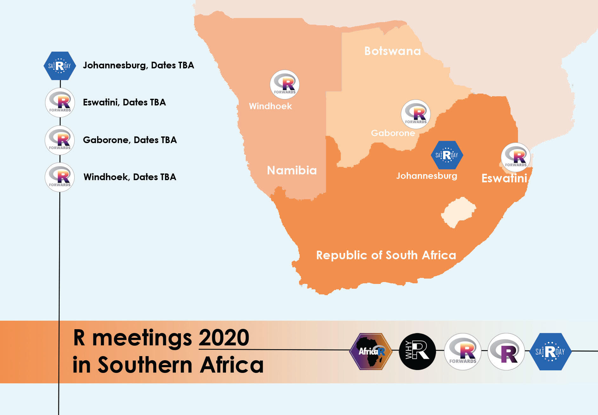

```{r setup, include=FALSE}
knitr::opts_chunk$set(echo = TRUE)

```

Limerick 2020
===============================

Column {data-width=800}
--------------------


<div class="container">
<div>

</div>
</div>

Column {data-width=600}
---------------
<h4> Why-R? Limerick </h4>

* Date: Saturday 1st February 2020
* Location: Thomond Park Stadium, Cratloe Road, Limerick.
* Times: 10.00am to 16:30pm approx
* Career Zoo Limerick's [Website](https://www.careerzoo.ie/limerick/)
* Why R? Limerick's [Website](https://www.careerzoo.ie/limerick/why-r-mini-conference.html)

<h4> Tickets </h4>
* Admission is free, but attendees must have registered for Career Zoo.


Tickets
===============================

<h4> Tickets</h4>

* Tickets can be ontained from [Career Zoo'z Eventbrite Page](https://www.eventbrite.ie/e/career-zoo-presents-tech-on-the-wild-atlantic-way-2020-tickets-77292514993#tickets)
* Tickets are free, but you must register for the event in advance.
* You should register for both Career Zoo and Why R?
* Please note that there are a limited number of tickets for the WhyR? event.

Schedule
===============================


<h2> Schedule </h2>

#### 10:00 - 10:30 MORNING TALK 1 (Munster Suite)
* What makes a good (fantasy) football manager?
* Presented by [Joey O'Brien](https://twitter.com/obrienj_)

#### 10:30 - 11:00 MORNING TALK 2 (Munster Suite)

* Using R-Shiny to Teach Quantitative Research Methods
* Presented by [Dr. Brendan Halpin (UL Sociology)](https://twitter.com/BrendanTHalpin)

<hline>

#### 11:10 CAREER ZOO COMMUNITY KEYNOTE @ Main stage

* [Dr. Norah Patten](https://twitter.com/SpaceNorah)
* Astronaut candidate with Project PoSSUM (Polar Suborbital Science in the Upper Mesosphere)
* N.B. This is not an R-specific talk
* TBC with Career Zoo Organizers

<hline>

#### 11.50  MORNING TALK 3 (Munster Suite)
* ETL with R: a quantitative finance application
* Davide Magno

* *Parallel to Creating an Autonomous Driving Hub*
* *N.B. Julia Computing should be scheduled in to be available for this* 

<hline>

#### 12.30 CAREER ZOO COMMUNITY KEYNOTE @ Main stage
* Helping beekeepers to reduce #honeybee losses & increase hive productivity with IOT technology.
* Dr Fiona Edwards Murphy, CEO and Co-founder of ApisProtect 
* N.B. This is not an R-specific talk
* TBC with Career Zoo Organizers

<hline>
<hline>

#### 13.10  LUNCH

* No Talk Scheduled
* (*Parallel to: Sci-tech / Life Balance. Meet the STEM workers who have chosen the Midwest* )

<hline>
<hline>


#### 13.40  AFTERNOON TALK 1 (Munster Suite)
* Knime with R
* Presented by [Paolo Tamagnini](https://twitter.com/paolotamag)
* *Parallel to: "Keynote Panel with Jaguar Land Rover"*

#### 14.10  AFTERNOON TALK 2 (Munster Suite)

* Data Optimisation Network
* Gaurav Pahuja
* Finalist in the European DatSci Student Data Scientist of the Year Awards 2019
* (*Parallel to: Sci-tech Ecosystem in the Midwest*)

####  14.40  AFTERNOON TALK 3 (Munster Suite)
* Visualizing Trends in the Loudness of Popular Music
* Presented by [David Curran](https://twitter.com/iamreddave)

* *Parallel to: "Opportunities in Aviation"*

<hline>


#### 15.10 CAREER ZOO COMMUNITY KEYNOTE @ Main stage

* [Abeba Birhane](https://twitter.com/Abebab) - Award winning PHD Student on ethics in AI 
* TBC with Career Zoo Organizers
* N.B. This is not an R-specific talk
* (This talk might be reschedule to previous slot)

<hline>


#### 15.40 AFTERNOON TALK 4 (Munster Suite)
* R in Official Statistics
* Sorcha O'Callaghan
* Central Statistics Office, Cork [www.cso.ie](www.cso.ie)


#### 16:20 AFTERNOON TALK 5 (Munster Suite)
* Agnes Maciocha (IT Carlow)
* Starting Time TBC
* Due to arrive at 16:00
* *Parallel to AI and emerging technologies creating new careers* 


Workshops
==============================

Column {.tabset}
------------------

### Machine Learning With Julia

* THIS EVENT IS NOW SOLD OUT

### Data Science Learnathon with KNIME

<b>What is a learnathon?</b>

It's between a hackathon and a workshop. It's like a workshop because we'll learn more about the data science cycle - data access, data blending, data preparation, model training, optimization, testing, and deployment. It's like a hackathon because we'll work in groups to hack a workflow-based solution to guided exercises.

The tool of choice for this learnathon is KNIME Analytics Platform - an open, open-source, GUI driven, data analytics platform, that covers all your data needs from data import to final deployment. Being open, KNIME offers a vast integration and IDE environment for R, Python, SQL, and Spark.

After an initial introduction to the tool and to the data science cycle, we'll split in to groups. Each group will focus on one of three aspects of the data science cycle:

* Group 1 - Working on the raw data. Data access and data preparation.

* Group 2 - Machine Learning. Which model shall I use? Which parameters?

* Group 3 - I have a great model. Now what? The model deployment phase.

Please also download the workshop material (jump-start workflows and instructions) from here. We'll import this material during the learnathon.

Paolo Tamagnini is a data scientist at KNIME, holds a master's degree in data science from Sapienza University of Rome and has research experience from NYU in data visualization techniques for machine learning interpretability. 

Follow Paolo on LinkedIn: linkedin.com/in/paolo-tamagnini/  

### Machine learning for coders

Machine Learning (ML) is no longer ring fenced to researchers and data scientists.

New high-level APIs are driving the democratisation of ML applications and enabling programmers to build and implement ML solutions in their own work. 

This talk describes how these APIs work and why they sometimes perform better than even state-of-the-art solutions.

Presenter: Iain Keaney (skellig.ai)

### Github

* Turbo-Charging your technical dexterity using Git and GitHub: A hands-on workshop

<h4>Abstract: </h4>
This workshop covers all that is needed to integrate git into your daily development life using GitHub.

We will begin with a discussion of what git is and how it works. 

Then a hands-on session, where we will run through multiple templated practical scenarios using Git commands. 

Lastly, we will wrap up by discussing other free offerings such as hosting websites using Pages.

(Requirement: A laptop)

Why R? Pre-meetings
==============================

Column
---------------------------------


Column
----------------------------------
#### Why R Pre-Meeting Series


* Why R? - [Website](https://www.whyr.pl)


Forwards
===============================

Column
---------------




Column
---------------

Forwards (the R Foundation taskforce for underrepresented groups) plan to deliver a number of workshops and talks in neighbouring countries to help develop the R community in Southern Africa. 

The events will be lead by Heather Turner, chair of [Forwards](forwards.github.io), in collaboration with local community organisers and will take place in the first half of March 2020.

#### Itinerary

The planned itinerary is outlined below, further links and dates will be added when available.

#### Johannesburg, South Africa (March 6-7, 2020)

In partnership with satRdays:

* R package development workshop (1 day)
* Conference keynote talk on Diversity and Inclusion in the R Community

#### eSwatini

Manzini, Eswatini (March 12, 2020, TBC)

In partnership with the recently established Eswatini useR group:

* Introduction to R for data analysis workshop (1 day)
* Meetup talk on the R community and resources available for newcomers


#### Botswana

Gaborone, Botswana (March 14-15, 2020)


In partnership with WiMLDS Gaborone and PyData Botswana:

Introduction to R workshop (1/2 day)

#### Namibia

Windhoek, Namibia (dates TBC)

In partnership with the Department of Statistics and Population Studies, University of Namibia:

* Introduction to R for data analysis workshop (1 day)
* Meetup talk on the R Community and resources available for newcomers
* The meetup will be the launch event of the first R User Group in Namibia