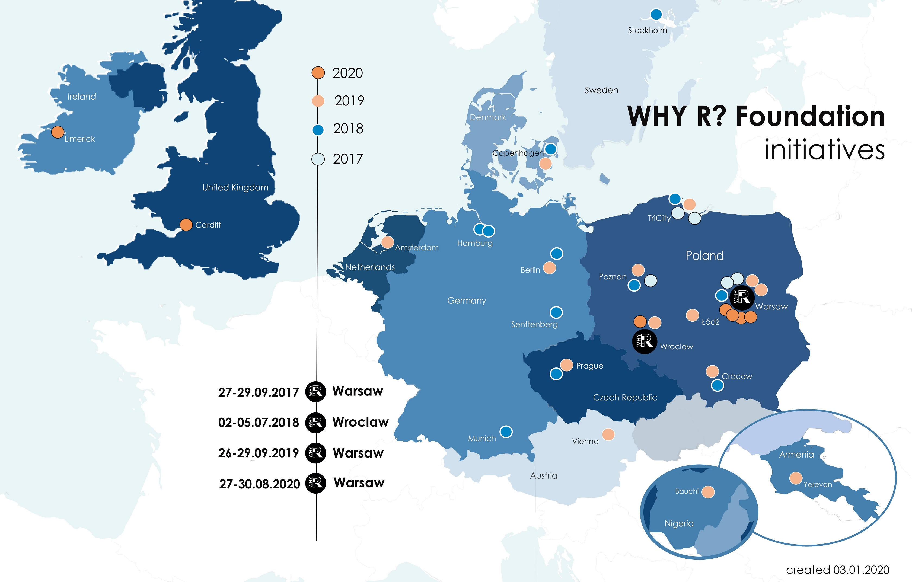

```{r setup, include=FALSE}
knitr::opts_chunk$set(echo = TRUE)

```


Why R? Virtual Conference 2021
===============================

Column
---------------------

#### Why R? 2021

<div>
<center>

</center>
</div>
<br>

* The Why R? Conference will take place virtually in December 2021.

* The prospective dates are Monday 6th December to Saturday 11th December

* N.B. The schedules for Monday 6th December to Friday 10th December will be approximately 4 hours for each day.

#### Proposed Themes for 2021 Conference

* Supporting Software Development Goals

* Research Software Engineer as a profession

* Open Source tools for Data Science and Engieering

* The R community in Asia

* The R community in the Middle East and North Africa

* Supporting the scientific community in remote locations


```{r child="content/sustainabledevelopmentgoals.Rmd"}

```


```{r child="content/researchsoftwareengineers.Rmd"}

```


```{r child="content/opensourcetools.Rmd"}

```


Why R? Pre-meetings {data-navmenu="Why R"}
==============================

Column 
-------------------------------------

### Why R? Pre-meetings Series


<center>
<div>

</div>
<b> Why R? pre-meeting series (2017-2020) </b>
</center>

<p>

The Why R? Foundation is a European R user community foundation. 

Historically, Why R? have ran a series of pre-meetings around Europe in anticipation of their main conference in Warsaw.


Forwards {data-navmenu="R Community"}
===============================

Column
---------------

### Forwards Southern Africa Project 2020

<div>
<center>

</center>
</div>
<br>
<div>
<center>

</center>
</div>

Column
---------------

### Forwards Southern Africa Project 2020

Forwards (the R Foundation taskforce for underrepresented groups) plan to deliver a number of workshops and talks in neighbouring countries to help develop the R community in Southern Africa. 

The events will be lead by Heather Turner, chair of [Forwards](forwards.github.io), in collaboration with local community organisers and will take place in the first half of March 2020.
<p>
<b> Itinerary</b>

The planned itinerary is outlined below, further links and dates will be added when available.

<p>
<b>Johannesburg, South Africa </b> 

In partnership with satRdays Johannesberg (March 6-7, 2020) 

* R package development workshop (1 day)
* Conference keynote talk by [Dr. Heather Turner](https://twitter.com/HeathrTurnr) on Diversity and Inclusion in the R Community

<p>
<b>Eswatini</b>

Manzini, Eswatini (March 12, 2020)

In partnership with the recently established [Eswatini R user group](meetup.com/EswatiniUseR/):

* Introduction to R for data analysis workshop (1 day)
* Meetup talk on the R community and resources available for newcomers

<p>
<b>Botswana</b>

Gaborone, Botswana (March 14-15, 2020)


In partnership with WiMLDS Gaborone and PyData Botswana:

Introduction to R workshop (1/2 day)

<p>
<b>Namibia</b>

Windhoek, Namibia (dates TBC)

In partnership with the Department of Statistics and Population Studies, University of Namibia:

* Introduction to R for data analysis workshop (1 day)
* Meetup talk on the R Community and resources available for newcomers
* The meetup will be the launch event of the first R User Group in Namibia


Code of Conduct
====================================
Column
------------------------------------

* Why R? Conferencce 2021 is dedicated to providing a harassment-free and inclusive conference experience for all in attendance regardless of, but not limited to, gender, sexual orientation, disabilities, physical attributes, age, ethnicity, social standing, religion or political affiliation.

* We do not tolerate harassment of participants (including organisers and vendors) in any form. Sexual innuendos and imagery are not appropriate for any conference venue, including presentations.
* Anyone violating these rules may be given warning or expelled from the conference (without a refund) at the discretion of the conference organisers. 

* Our code of conduct/anti-harassment policy can be found here. 
